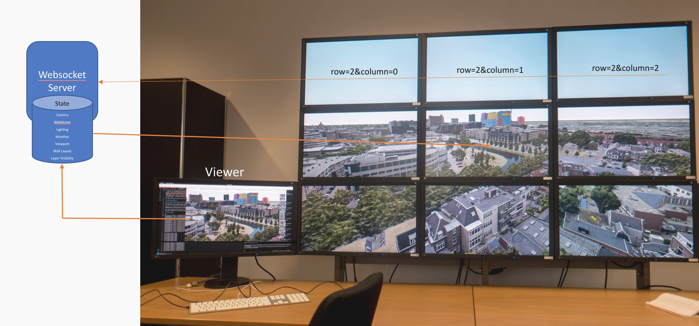

# Scalable GIS Renderer for the 3D ArcGIS Maps SDK for JavaScript

SaGIS synchronizes the camera and other state of a set of browser instances to create a single, large view of multiple displays. This open source project is a template for custom applications.

For collaborative settings, such as control rooms and presentations, rendering high resolution 3D maps on a large display provides both context and detail for a large group. This type of setup cannot be realized in a single web browser, due to performance and memory constraints.

Sagis solves this problem by distributed the rendering over a distributed cluster, where each display is driven by a separate browser instance, typically on a separate computer. The display is then controlled by a viewer instance on a desktop, laptop or mobile device. One central websocket server synchronizes the viewer and display instances.

## Setup

Install dependencies: `npm install`.

The first process to start in a cluster is the websocket server which will synchronize all clients using `npm run server`. The server maintains the overall display layout, as well as the last state seen to initialize late-joining display clients.

The second step is to configure and start the web server for the client and viewer applications: `npm run dev`.

The third step is to configure and launch all display clients: Launch one full-screen web browser on each computer, load and configure the tile for each display: `http://webserver:9001/client.html?server=wssmachine&row=1&column=1`. Replace webserver with the hostname running the web server. Replace wssmachine with the hostname running the websocket server. The row and column parameter are relative to the center of the screen, a 2x2 wall would have four clients with `[-0.5, -0.5], [-0.5, 0.5], [0.5, -0.5], [0.5, 0.5]` as their row/column. The server will compute the total shape of the wall from all clients.

The last step is to launch the view application from the control machine by pointing a web browser to `http://webserver:9001/viewer.html?server=wssmachine`. As with the clients, replace webserver and wssmachine with your hostnames.

The viewer should now connect to the server, and all clients should synchronize their view with the interactions on the viewer application.

## State Synchronization

Both the client and the viewer use the same [controller implementation](src/Controller.ts) to synchronize their state.

The controller on the viewer sends messages to the server, which re-broadcasts this message to all clients. Only a special tile message is interpreted by the server, to keep the global display wall layout state.

Messages are one character for the message type, followed by the message payload. The payload is typically the state in JSON. The viewer and client side deserialization and serialization must match for correct operation.

This sample implementation synchronizes some default state for viewing web scenes (webscene, camera, lighting, weather, layer visiblity). Applications are expected to extend this code for their needs.
